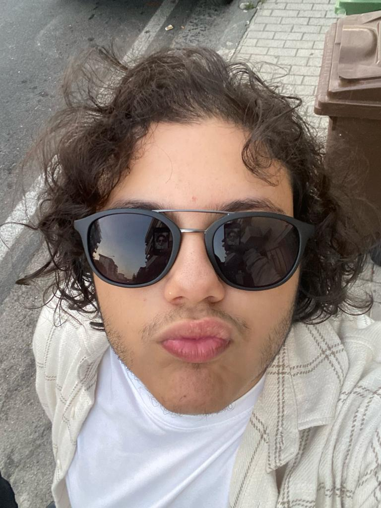

<h1 style="color: #DC4D01;">Welcome To Raffaele's Project</h1>

Hello and welcome! My name is Raffaele, and I'm a student at the Academy of Fine Arts in Naples, specializing in New Technologies of Art. This website was created as part of my academic journey, and it serves as a platform to share experiments, ideas, and projects related to the world of art and new technologies.

<figure markdown="span">
{ width="300" }
<figcaption>Top 10 Maranza</figcaption>
</figure>

<h1 style="color: #DC4D01;">What You'll Find on This Site</h1>

1) Artistic and experimental projects: a collection of my latest creations, from interactive design to digital visual art.

2) Reflections and inspirations: articles and notes on themes I’m passionate about, such as virtual reality, artificial intelligence, and new media.

3) Useful resources: links and tips on digital tools, software, and materials for those who share my interest in digital arts.

<h1 style="color: #DC4D01;">Explore And Discover</h1>

I hope you find something that interests you! Feel free to explore the site, learn more about my work, and join me in discovering how art and technology can interact in new and exciting ways.